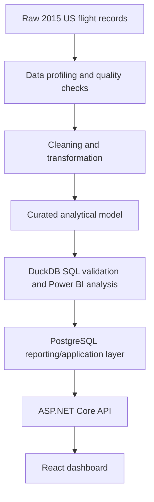
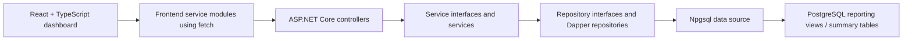
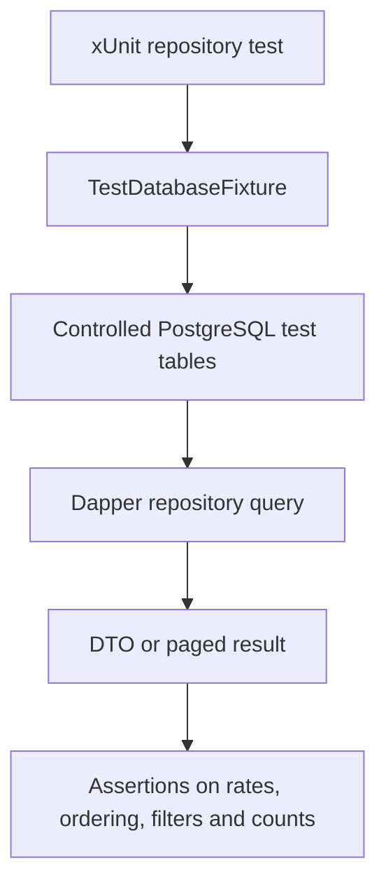

# Airline Operations Intelligence Platform

Airline Operations Intelligence Platform is a full-stack analytics MVP for exploring airline operational performance using historical US flight data from 2015. The broader portfolio work is based on roughly 5.8 million flight records and focuses on questions such as punctuality, severe delays, cancellations, diversions, airline comparison and operational prioritisation.

This repository is the application layer of that work. It turns the airline performance domain into a PostgreSQL-backed ASP.NET Core API and a React/TypeScript dashboard, rather than stopping at notebooks, SQL analysis or BI reporting.

The project is actively under development. The backend, database-facing repository layer, React dashboard pages and PostgreSQL-backed integration tests are already substantial, but this is not a finished or production-ready application.

## Built on the earlier analytics project

This application grows out of my earlier portfolio project:

[Airline Operational Performance Analytics](https://github.com/Anas-RT/airline-delay-analysis)

That earlier repository is the analytical and data-engineering foundation for this app. Its public scope includes data profiling, quality validation, cleaning and transformation, dimensional/star-schema modelling, KPI flag engineering, DuckDB SQL validation, airline/airport/route/time-based analysis and partially completed Power BI reporting. It is still evolving, so I describe it as the foundation for this application rather than as a closed or fully finished predecessor.

This repository extends that same domain into software engineering work:

- PostgreSQL reporting/application data structures consumed by the API
- ASP.NET Core controller, service and repository layers
- Dapper/Npgsql data access with typed DTOs
- React/TypeScript dashboard pages and reusable components
- Filtering, airline comparison, charting, pagination and scorecard views
- PostgreSQL-backed repository integration tests
- Environment-specific local configuration and preparation for CI/CD



The diagram shows the progression of the broader portfolio work. It should not be read as a fully automated production pipeline between the two repositories.

## Why I built it

The aim is to connect data analysis with application development. Airline delay analysis can live as static reports, but an operational analyst normally needs to filter, compare, drill into patterns and review prioritisation signals interactively.

This project explores that next step: taking analytical definitions such as OTP15, severe-delay rate and cancellation rate, then exposing them through an application architecture with database queries, API contracts, frontend state and repeatable tests.

## Current MVP status

Implemented areas include:

- Network Overview dashboard route with database-backed filters, KPI cards, monthly OTP15 trend, outcome mix and airline OTP15 comparison.
- Airline Performance dashboard route with severe-delay portfolio view, selected-airline KPI profile, airline-vs-network benchmark, monthly comparison and paged scorecard.
- ASP.NET Core API endpoints under `api/NetworkOverview` and `api/AirlinePerformance`.
- Repository SQL against PostgreSQL reporting objects such as `mv_networkoverview_summary`, `mv_airlineperformance_summary`, `vw_airlineperformance_airline_severe_delay_rate` and `vw_airlineperformance_scorecard`.
- xUnit repository integration tests that exercise real PostgreSQL queries using controlled test rows.

Still in progress:

- The Delay Severity page is currently only a placeholder route.
- Some UI copy, icons, visual details and responsive behaviour still need work.
- Several analytical interpretation blocks in the UI are provisional and should not be treated as final analytical conclusions.
- Frontend automated tests have dependencies/configuration present, but no substantive tracked frontend test suite yet.
- CI/CD and hosted deployment/database infrastructure are planned, not currently implemented in tracked workflow files.

## What the application currently does

The current MVP has two meaningful dashboard areas and one planned page.

| Area | Current implementation |
| --- | --- |
| Network Overview | Filter options, network KPI percentages, monthly OTP15 trend, flight outcome mix and airline OTP15 ranking. |
| Airline Performance | Severe-delay rate dataset, target-airline profile, network benchmark comparison, monthly OTP15 comparison and paginated all-airline scorecard. |
| Delay Severity | Route and page placeholder only; final dashboard content is not implemented yet. |

The implemented metrics focus on operational performance rather than raw flight-level browsing. The React frontend requests aggregated API responses and does not send the full flight dataset to the browser.

## Architecture

The current runtime path follows a simple layered design.



The backend is intentionally read-oriented. Dapper keeps the SQL visible, which fits this project because the interesting work is mostly reporting queries, KPI denominators and aggregation logic.

## Technology stack

| Area | Stack |
| --- | --- |
| Backend | ASP.NET Core Web API, C#, .NET 10, controller-based endpoints |
| Data access | PostgreSQL, Npgsql, Dapper, parameterised SQL |
| Frontend | React, TypeScript, Vite, React Router, CSS Modules, Recharts |
| Component work | Storybook for selected reusable components |
| Testing | xUnit, PostgreSQL-backed repository integration tests |
| Local database | Docker Compose file for PostgreSQL 17 development database |
| Pipeline area | Tracked Python dependency list for DuckDB/Pandas/PyArrow/Psycopg work; scripts are currently placeholders |

TanStack React Query is installed, but the tracked runtime code currently uses plain `fetch` calls in frontend service modules with React state/effects.

## Data and analytical approach

The application is built around aggregated operational metrics, not individual flight records in the UI. The tracked backend queries calculate rates from aggregated counts, for example:

- OTP15 rate from `otp15_flights / otp15_eligible_flights`
- severe-delay rate from severe-delay counts over OTP15-eligible flights
- cancellation rate from cancelled flights over total flights
- diversion rate from diverted flights over non-cancelled flights

That matters because percentages should be recomputed from additive numerators and denominators instead of averaged from precomputed percentages.

The current API expects PostgreSQL reporting objects such as:

- `mv_networkoverview_summary`
- `mv_airlineperformance_summary`
- `vw_airlineperformance_airline_severe_delay_rate`
- `vw_airlineperformance_scorecard`

The tracked `data-pipeline` folder currently contains requirements and placeholder script/SQL files. The README therefore does not claim that this repository already contains a complete automated data pipeline from the earlier analytics repository into PostgreSQL.

## Backend/API design

The backend is organised around controllers, service interfaces, service classes, repository interfaces, repository classes and DTOs.

Current Network Overview endpoints include:

- `GET /api/NetworkOverview/GetNetworkOverviewFiltersOptions`
- `GET /api/NetworkOverview/GetKpis`
- `GET /api/NetworkOverview/GetOtp15Monthly`
- `GET /api/NetworkOverview/GetFlightOutcomeMix`
- `GET /api/NetworkOverview/GetAirlineOtp15PerformanceRate`

Current Airline Performance endpoints include:

- `GET /api/AirlinePerformance/GetAirlinePerformanceSevereDelayRate`
- `GET /api/AirlinePerformance/GetAirlineKpis?targetAirline=...`
- `GET /api/AirlinePerformance/GetAirlineBenchmark?targetAirline=...`
- `GET /api/AirlinePerformance/GetAirlineMonthlyOtp15Comparison?targetAirline=...`
- `GET /api/AirlinePerformance/GetAirlineScorecard?pageNumber=...&pageSize=...`

The repository layer uses Dapper and Npgsql to run parameterised queries asynchronously for the main network overview paths and query methods returning typed DTOs/paged results.

## Frontend design

The frontend is a Vite React/TypeScript app with a dashboard shell and three routes:

- `/network-overview`
- `/airlines`
- `/delay-severity`

The implemented pages use shared components such as dashboard headers, KPI cards, narrative cards, filter controls, chart cards, horizontal bar charts, bubble charts, monthly trend charts, outcome mix charts and a paginated table.

Recharts is used for the chart components, including area, bar, scatter/bubble and pie-style visualisations. Storybook is configured for selected shared components, with tracked stories for examples such as `HorizontalBarChart`, `ChartLegend` and `NarrativeCard`.

## Testing

The backend test project uses xUnit and a shared PostgreSQL fixture. The fixture reads the test database connection string from:

```text
AIRLINE_TEST_DB_CONNECTION_STRING
```

The repository tests run against PostgreSQL through Npgsql rather than mocking the SQL layer.



Tracked tests currently cover important repository behaviour, including:

- Network overview filter-option ordering
- KPI calculations with and without filters
- monthly OTP15 aggregation
- outcome mix aggregation
- airline OTP15 ordering
- selected-airline KPI calculations
- airline-vs-network benchmark calculations
- monthly target-airline comparison
- scorecard pagination and total-count behaviour

This is useful coverage for the database-facing layer, but it is not full backend coverage. Controller/service coverage and frontend automated tests still need to be expanded.

## What this project demonstrates

This project is meant to show the connection between data work and application work:

- carrying KPI definitions from an analytical project into an application
- designing API responses around aggregated reporting data
- using PostgreSQL summary/view-style objects instead of repeatedly querying raw flight-level records from the frontend
- calculating rates from numerator/denominator counts
- writing parameterised Dapper SQL
- separating controller, service and repository responsibilities
- using interfaces and DTOs to keep backend boundaries explicit
- consuming API data from a React/TypeScript frontend
- building reusable dashboard components and Recharts visualisations
- supporting filtering, comparison, ordering and pagination
- testing repository/database behaviour with controlled PostgreSQL data
- keeping real credentials outside the tracked source

## Known limitations and current development work

This is an active MVP, so the README is intentionally not presenting it as complete.

- Delay Severity is not fully implemented yet.
- Some UI icons, smaller visual details and responsive behaviours need more work.
- Some frontend and backend edge cases still need to be fixed.
- The current analytical narrative text shown in the UI is provisional. It demonstrates how the application may eventually communicate operational findings, but it should not be treated as validated final analysis.
- Target-airline selection is still being refined. The current implementation selects a development target using volume and severe-delay conditions, but it should not be described as objectively identifying the "worst" airline.
- A more defensible future selection method may consider meaningful operational volume, below-network OTP15, above-network severe-delay rate, persistence across months and cancellation/disruption context.
- Backend tests cover important repository/database behaviour, but not the whole backend.
- Frontend automated testing still needs to be added.
- GitHub Actions CI is planned or being introduced, but no tracked workflow file exists at the time of writing.
- CD/deployment infrastructure and hosted database setup are not complete.
- The main application PostgreSQL database currently runs locally during development.

## Roadmap

Near-term work:

- Complete the Delay Severity dashboard/page.
- Refine remaining airline-performance interactions and target-airline selection logic.
- Replace provisional narrative text with validated analytical interpretation.
- Improve responsive behaviour and UI polish.
- Fix remaining frontend/backend bugs and edge cases.
- Expand backend tests beyond repository coverage.
- Add frontend/component tests.
- Add GitHub Actions CI.
- Add deployment/CD later and move from local development database to hosted infrastructure.
- Continue improving documentation as the implementation settles.

## Local setup

These instructions are based only on tracked configuration files.

### Prerequisites

- .NET SDK compatible with the `net10.0` projects
- Node.js and npm
- Docker, if using the tracked PostgreSQL Compose file
- PostgreSQL access for the application database and the integration test database

### Configuration

Real credentials are intentionally not committed.

The tracked `.env.example` documents placeholder values, including:

```text
VITE_API_BASE_URL=http://localhost:5000
POSTGRES_DB=airline_operations
POSTGRES_USER=postgres
POSTGRES_PASSWORD=change_me
```

Set `VITE_API_BASE_URL` to the local API origin you are actually running. The value in `.env.example` is a placeholder/example.

The ASP.NET Core API currently reads its database connection from `ConnectionStrings:DefaultConnection`. For local development, configure that value outside source control, for example through local user secrets or another environment-specific configuration mechanism. Use your own local PostgreSQL connection string, not a committed password.

For backend integration tests, set:

```text
AIRLINE_TEST_DB_CONNECTION_STRING=<your-test-postgresql-connection-string>
```

### Run the local database

The tracked `docker-compose.yml` defines a local PostgreSQL 17 service with placeholder credentials:

```bash
docker compose up -d
```

### Run the backend

```bash
cd backend
dotnet restore
dotnet run --project src/AirlineOperations.Api/AirlineOperations.Api.csproj
```

### Run the frontend

```bash
cd frontend
npm install
npm run dev
```

The Vite dev server is configured for port `5173`. The backend CORS policy allows `http://localhost:5173`.

### Run backend tests

Point `AIRLINE_TEST_DB_CONNECTION_STRING` at a PostgreSQL database you are comfortable using for tests, then run:

```bash
cd backend
dotnet test
```

The tests insert and reset controlled rows and should use a dedicated test database, not a personal or production database.

## Repository structure

```text
airline-operations-platform/
|-- README.md
|-- .env.example
|-- docker-compose.yml
|-- docs/
|   |-- architecture.md
|   |-- api-contracts.md
|   |-- data-model.md
|   |-- prerequisites.md
|   |-- project-scope.md
|   |-- repository-structure.md
|   `-- upstream-analysis-source.md
|-- backend/
|   |-- AirlineOperations.slnx
|   |-- src/AirlineOperations.Api/
|   |   |-- Controllers/
|   |   |-- DTOs/
|   |   |-- Interfaces/
|   |   |-- Repositories/
|   |   |-- Services/
|   |   `-- Program.cs
|   `-- tests/AirlineOperations.Api.Tests/
|       |-- Collections/
|       |-- Fixtures/
|       `-- Repositories/
|-- frontend/
|   |-- .storybook/
|   |-- src/
|   |   |-- app/
|   |   |-- pages/
|   |   |-- shared/
|   |   `-- main.tsx
|   |-- package.json
|   `-- vite.config.ts
`-- data-pipeline/
    |-- requirements.txt
    |-- scripts/
    `-- sql/
```

## Screenshots

No tracked dashboard screenshots are currently included in this repository. I will add this section once the UI is stable enough for screenshots to be useful rather than misleading.

## Closing note

This project is deliberately positioned between analytics and software engineering. The earlier repository explains much of the data reasoning; this repository is where that reasoning is being turned into a working full-stack application with API boundaries, UI flows, database-backed tests and a path toward CI/CD and deployment.
