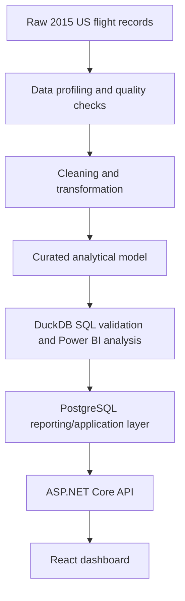
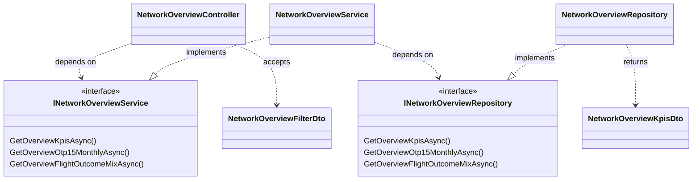
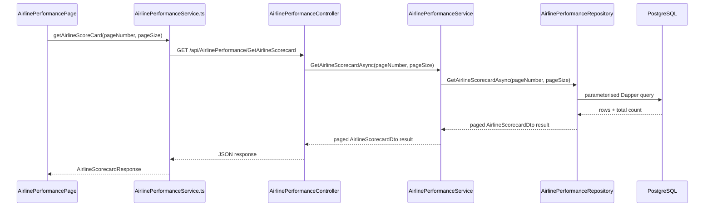
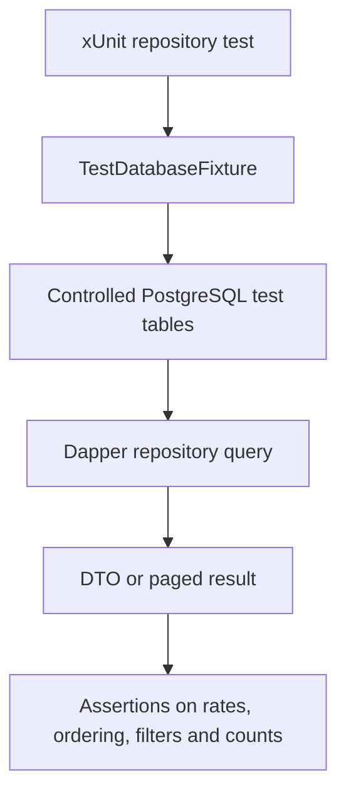

# Airline Operations Intelligence Platform

Airline Operations Intelligence Platform is a full-stack analytics MVP for exploring airline operational performance using historical US flight data from 2015. The broader portfolio work is based on roughly 5.8 million flight records and focuses on punctuality, severe delays, cancellations, diversions, airline comparison and operational prioritisation.

This repository is the application layer of that work. It turns the airline performance domain into a PostgreSQL-backed ASP.NET Core API and a React/TypeScript dashboard, rather than stopping at notebooks, SQL analysis or BI reporting.

The project is actively under development, but the core engineering work is already substantial: database-facing repository queries, API DTOs, React dashboard pages, pagination, KPI calculations and PostgreSQL-backed integration tests are all present in the tracked code.

## Built on the earlier analytics project

This application grows out of my earlier portfolio project:

[Airline Operational Performance Analytics](https://github.com/Anas-RT/airline-delay-analysis)

That earlier repository is the analytical and data-engineering foundation for this app. Its public scope includes data profiling, quality validation, cleaning and transformation, dimensional/star-schema modelling, KPI flag engineering, DuckDB SQL validation, airline/airport/route/time-based analysis and partially completed Power BI reporting.

This repository extends that same domain into software engineering work:

- PostgreSQL reporting/application data consumed by an ASP.NET Core API
- controller, service and repository layers with typed DTOs
- Dapper/Npgsql data access and PostgreSQL-backed integration tests
- React/TypeScript dashboard pages with reusable components, filtering, charting and pagination
- environment-specific configuration and preparation for CI/CD



This shows the progression of the broader portfolio work. The two repositories are connected stages of the same domain, not yet a fully automated production ingestion pipeline.

## Current MVP status

The current MVP includes two meaningful dashboard areas and one planned page.

| Area | Current implementation |
| --- | --- |
| Network Overview | Database-backed filters, network KPI percentages, monthly OTP15 trend, flight outcome mix and airline OTP15 ranking. |
| Airline Performance | Severe-delay portfolio view, selected-airline KPI profile, network benchmark comparison, monthly OTP15 comparison and paginated all-airline scorecard. |
| Delay Severity | Route and page placeholder; full dashboard content is still planned. |

Implemented backend work includes:

- ASP.NET Core API endpoints under `api/NetworkOverview` and `api/AirlinePerformance`
- controller -> service -> repository layering with interfaces
- typed DTOs, paged result contracts and Dapper/Npgsql queries against PostgreSQL reporting objects
- xUnit repository integration tests with controlled PostgreSQL test data

The application works with aggregated operational metrics rather than sending raw flight-level records to the browser.

## Architecture

The backend follows a controller -> service -> repository structure. This representative Network Overview slice shows the main dependency direction without listing every DTO in the project.



Dapper is a deliberate fit for this version because the backend is read-oriented and the important logic is in explicit analytical/reporting SQL against PostgreSQL.

## Technology stack

| Area | Stack |
| --- | --- |
| Backend | ASP.NET Core Web API, C#, .NET 10, controller-based endpoints |
| Data access | PostgreSQL, Npgsql, Dapper, parameterised SQL |
| Frontend | React, TypeScript, Vite, React Router, CSS Modules, Recharts |
| Component work | Storybook for selected reusable components |
| Testing | xUnit, PostgreSQL-backed repository integration tests |
| Local database | Docker Compose file for PostgreSQL 17 |
| Pipeline area | Python dependency list for DuckDB/Pandas/PyArrow/Psycopg work; scripts are still placeholders |

TanStack React Query is installed, but the tracked runtime code currently uses plain `fetch` calls in frontend service modules with React state/effects.

## Data and analytical approach

The backend queries calculate rates from aggregated counts:

- OTP15 rate from `otp15_flights / otp15_eligible_flights`
- severe-delay rate from severe-delay counts over OTP15-eligible flights
- cancellation rate from cancelled flights over total flights
- diversion rate from diverted flights over non-cancelled flights

This keeps the calculations tied to additive numerators and denominators rather than averaging precomputed percentages.

The API currently reads from PostgreSQL reporting objects including:

- `mv_networkoverview_summary`
- `mv_airlineperformance_summary`
- `vw_airlineperformance_airline_severe_delay_rate`
- `vw_airlineperformance_scorecard`

The `data-pipeline` area is still being developed, so the earlier analytics project and this application are not yet connected through a complete automated ingestion pipeline.

## Backend/API design

The backend is organised around controllers, service interfaces, service classes, repository interfaces, repository classes and DTOs.

| Area | Implemented API examples |
| --- | --- |
| Network Overview | `GetNetworkOverviewFiltersOptions`, `GetKpis`, `GetOtp15Monthly`, `GetFlightOutcomeMix`, `GetAirlineOtp15PerformanceRate` |
| Airline Performance | `GetAirlinePerformanceSevereDelayRate`, `GetAirlineKpis`, `GetAirlineBenchmark`, `GetAirlineMonthlyOtp15Comparison`, `GetAirlineScorecard` |

The repository layer uses parameterised Dapper queries with Npgsql and returns typed DTOs or paged results.

One implemented request path looks like this:



## Frontend design

The frontend is a Vite React/TypeScript app with a dashboard shell and three routes:

- `/network-overview`
- `/airlines`
- `/delay-severity`

The implemented pages use shared components such as dashboard headers, KPI cards, narrative cards, filter controls, chart cards, horizontal bar charts, bubble charts, monthly trend charts, outcome mix charts and a paginated table.

Recharts is used for the chart components, including area, bar, scatter/bubble and pie-style visualisations. Storybook is configured for selected shared components, with tracked stories for examples such as `HorizontalBarChart`, `ChartLegend` and `NarrativeCard`.

## Testing

The backend test project uses xUnit and a shared PostgreSQL fixture. The fixture reads the test database connection string from:

```text
AIRLINE_TEST_DB_CONNECTION_STRING
```

Repository integration tests run real PostgreSQL queries through Npgsql rather than mocking the SQL layer.



Tracked tests cover filter-option ordering, KPI calculations with and without filters, monthly aggregation, outcome mix, airline ordering, target-airline KPIs, airline-vs-network benchmarks, monthly comparison, scorecard pagination and total-count behaviour.

## What this project demonstrates

This project is meant to show the connection between data work and application work:

- carrying KPI definitions from an analytical project into an application
- designing API responses around aggregated PostgreSQL reporting data
- calculating rates from numerator/denominator counts
- writing parameterised Dapper/Npgsql data-access code
- separating controller, service and repository responsibilities with interfaces and DTOs
- consuming API data from a React/TypeScript frontend
- building reusable dashboard components and Recharts visualisations
- supporting filtering, comparison, ordering and pagination
- testing repository/database behaviour with controlled PostgreSQL data
- keeping real credentials outside the tracked source

## Known limitations and current development work

This is the main list of current unfinished areas:

- Delay Severity still needs its full dashboard implementation.
- Responsive behaviour, icons and smaller UI details need more polish.
- Some frontend and backend edge cases remain.
- The underlying KPI calculations are implemented, but some written operational interpretations in the UI are provisional examples and need validation/refinement.
- Target-airline selection currently uses a development heuristic based on operational scale and severe-delay characteristics. It is not an objective "worst airline" label, and the methodology should evolve toward clearer criteria such as meaningful volume, below-network OTP15, above-network severe-delay rate, persistence over time and cancellation/disruption context.
- Backend tests cover important repository/database behaviour, but not the whole backend.
- Frontend automated testing still needs to be added.
- GitHub Actions CI, CD/deployment and hosted database infrastructure are planned.

## Roadmap

- Complete the Delay Severity dashboard.
- Validate and refine analytical interpretation text.
- Formalise the target-airline selection methodology.
- Improve responsive behaviour and UI polish.
- Expand backend and frontend automated testing.
- Add GitHub Actions CI.
- Add deployment/CD and hosted infrastructure.
- Continue refactoring and documentation as the implementation settles.

## Local setup

These instructions use only tracked configuration and placeholder values.

### Prerequisites

- .NET SDK compatible with the `net10.0` projects
- Node.js and npm
- Docker, if using the tracked PostgreSQL Compose file
- PostgreSQL access for the application database and integration test database

### Configuration

Real credentials are intentionally kept outside source control.

The tracked `.env.example` documents placeholder values, including:

```text
VITE_API_BASE_URL=http://localhost:5000
POSTGRES_DB=airline_operations
POSTGRES_USER=postgres
POSTGRES_PASSWORD=change_me
```

Set `VITE_API_BASE_URL` to the local API origin you are running. The ASP.NET Core API reads its database connection from `ConnectionStrings:DefaultConnection`, which should be configured outside source control with your own PostgreSQL connection string.

For backend integration tests, set:

```text
AIRLINE_TEST_DB_CONNECTION_STRING=<your-test-postgresql-connection-string>
```

### Run locally

Start the local PostgreSQL service:

```bash
docker compose up -d
```

Run the backend:

```bash
cd backend
dotnet restore
dotnet run --project src/AirlineOperations.Api/AirlineOperations.Api.csproj
```

Run the frontend:

```bash
cd frontend
npm install
npm run dev
```

The Vite dev server is configured for port `5173`. The backend CORS policy allows `http://localhost:5173`.

Run backend tests with a dedicated PostgreSQL test database:

```bash
cd backend
dotnet test
```

The tests insert and reset controlled rows, so do not point `AIRLINE_TEST_DB_CONNECTION_STRING` at a personal or production database.

## Repository structure

```text
airline-operations-platform/
|-- README.md
|-- .env.example
|-- docker-compose.yml
|-- docs/
|-- backend/
|   |-- AirlineOperations.slnx
|   |-- src/AirlineOperations.Api/
|   `-- tests/AirlineOperations.Api.Tests/
|-- frontend/
|   |-- .storybook/
|   |-- src/
|   |-- package.json
|   `-- vite.config.ts
`-- data-pipeline/
    |-- requirements.txt
    |-- scripts/
    `-- sql/
```
